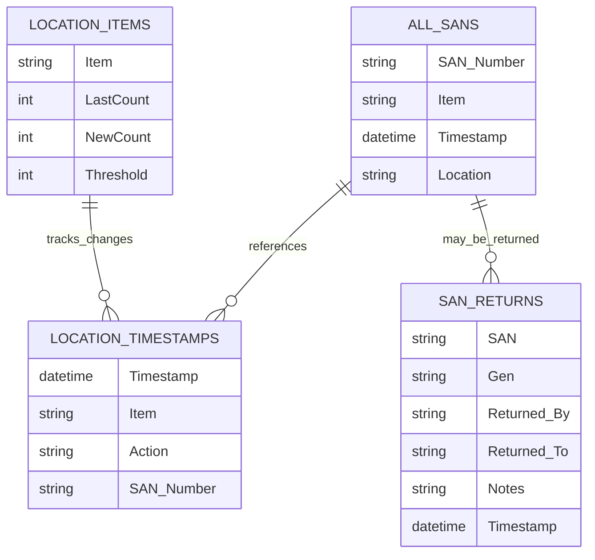

# Technical Documentation

## Architecture Overview

The EUC Asset Tracker follows a layered architecture pattern with clear separation of concerns and modular design principles.

### System Architecture

```
┌─────────────────────────────────────────────────────────────┐
│                    Presentation Layer                       │
│  ┌─────────────────┐ ┌─────────────────┐ ┌─────────────────┐│
│  │   CustomTkinter │ │    Tkinter      │ │   Matplotlib    ││
│  │      GUI        │ │   Components    │ │   Plotting      ││
│  └─────────────────┘ └─────────────────┘ └─────────────────┘│
├─────────────────────────────────────────────────────────────┤
│                    Business Logic Layer                     │
│  ┌─────────────────┐ ┌─────────────────┐ ┌─────────────────┐│
│  │   Inventory     │ │      SAN        │ │   Reporting     ││
│  │   Management    │ │   Management    │ │    Engine       ││
│  └─────────────────┘ └─────────────────┘ └─────────────────┘│
├─────────────────────────────────────────────────────────────┤
│                     Data Access Layer                       │
│  ┌─────────────────┐ ┌─────────────────┐ ┌─────────────────┐│
│  │    OpenPyXL     │ │     Pandas      │ │   File System   ││
│  │   Integration   │ │   Processing    │ │    Operations   ││
│  └─────────────────┘ └─────────────────┘ └─────────────────┘│
├─────────────────────────────────────────────────────────────┤
│                      Data Storage                           │
│              Excel Workbook (EUC_Perth_Assets.xlsx)        │
└─────────────────────────────────────────────────────────────┘
```

## Core Components

### 1. Main Application (`euc_stock_wa.v1.2.3.py`)

The primary application file containing the main GUI and business logic.

#### Key Classes and Functions

**SANInputDialog Class**
```python
class SANInputDialog(tk.Toplevel):
    """
    Modal dialog for SAN number input with validation.
    
    Features:
    - Numeric-only input validation
    - Enter key submission
    - Focus management
    - Error handling
    """
```

**Core Functions**

| Function | Purpose | Parameters |
|----------|---------|------------|
| `update_count(operation)` | Primary inventory update function | operation: 'add' or 'subtract' |
| `log_change()` | Records all inventory transactions | item, action, san_number, timestamp_sheet, volume |
| `switch_sheets(sheet_type)` | Changes active location | sheet_type: location identifier |
| `is_san_unique()` | Validates SAN uniqueness | san_number: string |
| `save_config()` | Persists workbook path | workbook_path: file path |

### 2. Plotting Modules

Independent scripts for generating inventory visualizations.

#### Module Structure

**Base Plotting Components**
- Argument parsing for output path specification
- Excel file loading and validation
- Data preprocessing (NaN handling)
- Matplotlib chart generation
- File output management

**Individual Plot Scripts**

| Script | Purpose | Data Source |
|--------|---------|-------------|
| `inventory-levels_4.2v3.py` | Basement 4.2 visualization | 4.2_Items sheet |
| `inventory-levels_BRv2.3.py` | Build Room visualization | BR_Items sheet |
| `inventory-levels_darwin.v2.py` | Darwin visualization | Darwin_Items sheet |
| `inventory-levels_combinedv1.5.py` | Aggregated visualization | All location sheets |

### 3. Configuration Management (`config.py`)

Simple configuration storage for application settings.

```python
# Auto-generated configuration file
workbook_path = r'C:/Users/Hard-Worker/Documents/GitHub/asset-tracker/EUC_Perth_Assets.xlsx'
```

## Data Model

### Excel Workbook Structure

The application relies on a structured Excel workbook with specific sheet naming conventions and column layouts.

#### Sheet Categories

**1. Inventory Sheets**
- Format: `{Location}_Items`
- Purpose: Store current inventory counts
- Columns: Item, LastCount, NewCount, Threshold

**2. Transaction Log Sheets**
- Format: `{Location}_Timestamps`
- Purpose: Record all inventory changes
- Columns: Timestamp, Item, Action, SAN Number

**3. Master Tracking Sheets**
- `All_SANs`: Central SAN registry
- `SAN_Returns`: Asset return tracking

#### Data Relationships



## Core Algorithms

### Inventory Update Algorithm

```python
def update_inventory_logic():
    """
    Pseudocode for inventory update process
    """
    # 1. Validate user input
    if not is_valid_input(input_value):
        show_error("Invalid input")
        return
    
    # 2. Handle SAN-required items
    if item_requires_san(selected_item):
        for each_item in range(input_value):
            san = prompt_for_san()
            if operation == 'add':
                validate_san_unique(san)
                add_to_all_sans(san, item, location)
            elif operation == 'subtract':
                validate_san_exists(san, item)
                remove_from_all_sans(san)
            log_san_transaction(san, item, operation)
    
    # 3. Update inventory counts
    update_sheet_counts(item, input_value, operation)
    
    # 4. Log aggregate transaction
    log_inventory_change(item, operation, volume)
    
    # 5. Refresh displays
    update_treeview()
    update_log_view()
    save_workbook()
```

### SAN Validation Algorithm

```python
def san_validation_process():
    """
    Multi-layer SAN validation system
    """
    # Input validation
    if not is_numeric(san_input):
        return False
    
    if not is_correct_length(san_input):
        return False
    
    # Uniqueness validation
    formatted_san = format_san(san_input)
    if san_exists_in_system(formatted_san):
        return False
    
    # Context validation (for removal)
    if operation == 'subtract':
        if not san_matches_item_type(formatted_san, selected_item):
            return False
    
    return True
```

## GUI Framework Implementation

### CustomTkinter Integration

The application leverages CustomTkinter for modern UI components while maintaining tkinter compatibility for complex widgets.

**Framework Selection Rationale**
- Modern appearance with minimal code changes
- Backward compatibility with existing tkinter code
- Enhanced button and frame styling
- Consistent cross-platform appearance

**Key UI Components**

```python
# Primary application window
root = ctk.CTk()
root.title("EUC Assets - WA")
root.geometry("675x850")

# Location selection buttons
for col, (text, command) in enumerate(buttons):
    btn = ctk.CTkButton(
        location_buttons_frame,
        text=text,
        width=button_width,
        font=("Helvetica", 14, "normal"),
        corner_radius=3
    )
```

### Treeview Implementation

Inventory and log displays use ttk.Treeview for tabular data presentation.

**Features**
- Alternating row colors for readability
- Right-click context menus
- Sorting capabilities
- Copy-to-clipboard functionality

```python
# Treeview configuration
style = ttk.Style()
style.configure("Treeview",
                font=("Helvetica", 12),
                rowheight=25,
                background="#f9f9f9",
                foreground="#333",
                fieldbackground="#f9f9f9")
```

## Error Handling and Logging

### Logging Framework

The application implements comprehensive logging for debugging and audit purposes.

```python
# Logging configuration
logging_conf_path = Path('logging.conf')
if logging_conf_path.exists() and logging_conf_path.stat().st_size > 0:
    try:
        logging.config.fileConfig(logging_conf_path)
    except Exception as e:
        logging.error(f"Error configuring logging: {e}", exc_info=True)
else:
    logging.basicConfig(level=logging.DEBUG)
```

**Log Categories**
- INFO: Normal operations (inventory changes, file operations)
- WARNING: Non-critical issues (missing optional sheets)
- ERROR: Critical failures (file access, validation errors)
- DEBUG: Detailed execution flow (development use)

### Exception Handling Strategy

**File Operations**
```python
try:
    workbook = load_workbook(workbook_path)
except FileNotFoundError:
    tk.messagebox.showerror("Error", "Excel file not found")
    raise SystemExit
except PermissionError:
    tk.messagebox.showerror("Error", "Cannot access file - check permissions")
except Exception as e:
    logging.error(f"Unexpected error loading workbook: {e}")
    tk.messagebox.showerror("Error", f"Failed to load data: {e}")
```

**User Input Validation**
```python
# Numeric-only input validation
vcmd = (root.register(lambda P: P.isdigit() or P == ""), '%P')
entry_value = tk.Entry(validation="key", validatecommand=vcmd)
```

## Data Processing Pipeline

### Excel Integration

The application uses openpyxl for Excel file manipulation, providing robust workbook operations.

**Key Operations**
- Sheet creation and management
- Cell value updates with type preservation
- Formula preservation
- Automatic calculation updates

```python
# Workbook operations
def update_inventory_sheet(item, operation, value):
    item_sheet = workbook[current_sheets[0]]
    for row in item_sheet.iter_rows(min_row=2):
        if row[0].value == item:
            row[1].value = row[2].value or 0  # Update LastCount
            if operation == 'add':
                row[2].value = (row[2].value or 0) + value
            elif operation == 'subtract':
                row[2].value = max((row[2].value or 0) - value, 0)
            break
```

### Data Validation Layer

**Input Sanitization**
- Numeric validation for quantities
- SAN format validation (5-6 digits)
- String length limits for text fields
- Date format validation for timestamps

**Business Rule Validation**
- SAN uniqueness constraints
- Inventory non-negative constraints
- Item-SAN type matching
- Location-specific validation

## Performance Considerations

### Memory Management

**Efficient Data Handling**
- Lazy loading of Excel sheets
- Minimal data caching
- Immediate garbage collection of large objects
- Stream processing for large datasets

**UI Responsiveness**
- Background processing for plot generation
- Progressive UI updates
- Non-blocking file operations
- Efficient Treeview updates

### Scalability Factors

**Current Limitations**
- Single-user Excel file access
- In-memory data processing
- Synchronous UI operations
- File-based configuration

**Optimization Strategies**
- Batch operations for multiple updates
- Selective sheet loading
- Cached validation results
- Incremental save operations

## Security Considerations

### Data Protection

**File Access Security**
- Read/write permission validation
- File locking during operations
- Backup creation before modifications
- Error recovery mechanisms

**Input Validation Security**
- SQL injection prevention (though not applicable to Excel)
- Path traversal prevention
- Input length limitations
- Special character filtering

### Audit Trail

**Complete Transaction Logging**
- User action tracking
- Timestamp precision
- Change attribution
- Rollback capability preparation

## Testing Strategy

### Unit Testing Approach

**Core Function Testing**
```python
def test_san_validation():
    """Test SAN validation logic"""
    assert is_san_unique("12345") == True
    assert is_san_unique("SAN12345") == False  # Existing SAN
    assert validate_san_format("12345") == True
    assert validate_san_format("1234") == False  # Too short
```

**Integration Testing**
- Excel file operations
- GUI component interactions
- Plot generation pipeline
- Cross-location data consistency

### Error Simulation

**Common Failure Scenarios**
- Corrupted Excel files
- Missing sheet structures
- Network drive access issues
- Concurrent file access
- Memory constraints

## Deployment Architecture

### Distribution Strategy

**Standalone Application**
- Self-contained Python environment
- Bundled dependencies
- Platform-specific packaging
- Auto-update mechanisms

**Requirements Management**
```
# requirements.txt
customtkinter>=5.0.0
openpyxl>=3.1.0
pandas>=1.5.0
matplotlib>=3.6.0
argparse>=1.4.0
pathlib>=1.0.1
```

### Configuration Management

**Environment-Specific Settings**
- Development vs. Production paths
- Logging level configuration
- Default threshold values
- UI scaling factors

**Dynamic Configuration**
```python
# config.py structure
class Config:
    WORKBOOK_PATH = r'path/to/workbook.xlsx'
    DEFAULT_THRESHOLD = 10
    PLOT_OUTPUT_DIR = 'Plots'
    LOG_LEVEL = 'INFO'
    UI_SCALE_FACTOR = 1.0
```

## Future Enhancements

### Planned Architecture Improvements

**Database Migration**
- SQLite integration for better performance
- Multi-user support
- Advanced querying capabilities
- Better data integrity constraints

**API Development**
- RESTful API for external integrations
- Real-time synchronization
- Mobile application support
- Cloud storage integration

**Enhanced Security**
- User authentication system
- Role-based access control
- Encrypted data storage
- Audit log encryption

### Modularization Roadmap

**Separation of Concerns**
- Data access layer abstraction
- Business logic service layer
- UI component library
- Configuration management service

**Plugin Architecture**
- Custom reporting modules
- Third-party integrations
- Location-specific customizations
- Industry-specific adaptations

---

*Technical documentation last updated: June 28, 2025*
