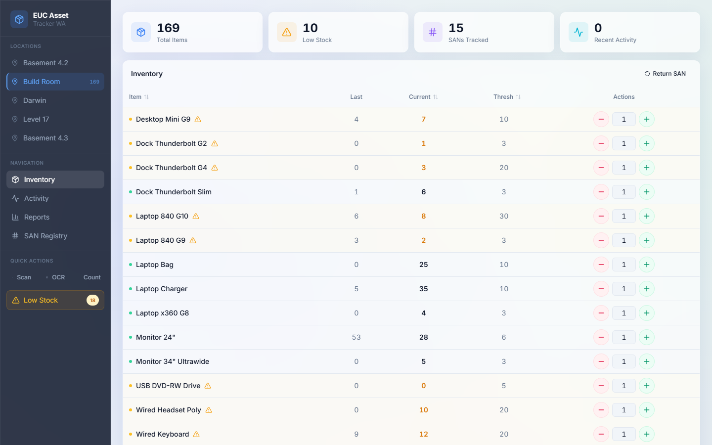
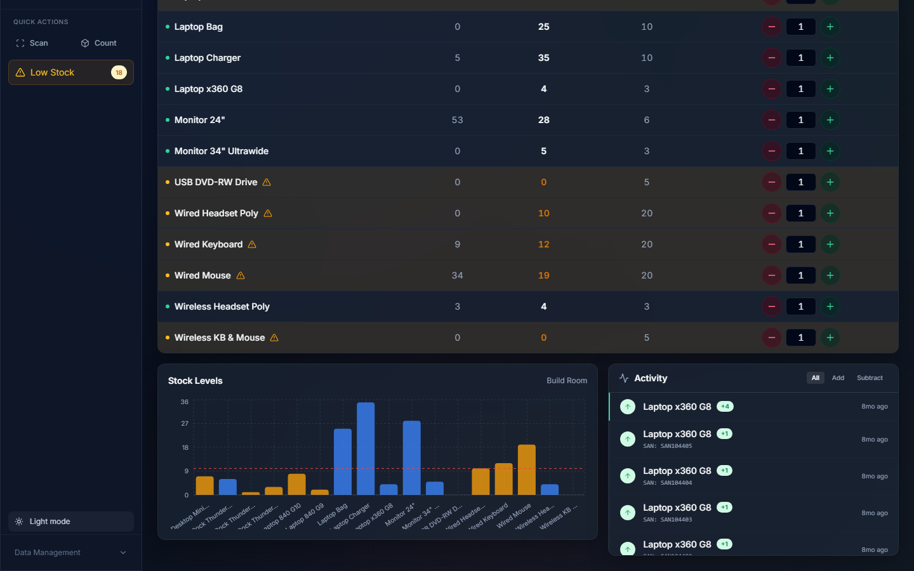

# Asset Tracker

**Open-source PWA for tracking inventory across multiple locations.** Add your own rooms, device types, and asset numbering format — works offline, installs on mobile, scans with your camera.



---

## Demo: Perth IT Inventory

The built-in "Load Demo" preset loads a real-world IT inventory. It's a working example you can explore immediately — no setup required.

**What the demo contains:**

| Location | Description | Items tracked |
|----------|-------------|--------------|
| **Basement 4.2** | Main storage — 17 device types | 62× Desktop Mini G9, 45× Laptop 840 G10, 75× Wired Headset Poly, 98× Laptop Charger… |
| **Build Room** | Prep & imaging workstation | Desktop minis, docks, laptops being configured |
| **Darwin** | Remote site — Northern Territory | Laptops, peripherals, monitors |
| **Level 17** | Office floor deployment | Docking stations, keyboards, mice |
| **Basement 4.3** | Overflow storage | Mixed hardware, monitors, accessories |

**Asset number format:** SAN (5–6 digit serial) — validated on entry, extracted via OCR camera scan.

**Low-stock threshold examples from the demo:**

```
Laptop 840 G10   45 in stock   threshold 30   ✅ ok
Laptop x360 G8   22 in stock   threshold  4   ✅ ok
Dock TB Slim      6 in stock   threshold  3   ✅ ok
Monitor 24"       6 in stock   threshold  3   ⚠️  near threshold
Laptop 840 G9 (Build Room)  2 in stock  threshold 3  🔴 LOW STOCK
```

> **Click "Load Demo" on the setup wizard to explore this data live in your browser.**



---

## How to Use

### 1. Open the app — pick a starting point

On first visit the setup wizard appears:

- **Load Demo** → Load the Perth IT preset (56 assets, 5 locations, SAN format)
- **Start Fresh** → Enter a workspace name, your first location, and asset number format

### 2. Configure your workspace in Settings

| Tab | What you configure |
|-----|--------------------|
| **Locations** | Add / remove rooms, sites, floors — anything with distinct inventory |
| **Asset Types** | Device/item names, categories, which types require asset numbers |
| **Asset Number** | Display name ("SAN", "Tag", "Serial"), regex pattern, OCR pattern, prefix |
| **Workspace** | Rename or factory-reset |

### 3. Track inventory

- **+/− buttons** to adjust counts in the table
- **Add Item** to create new asset rows
- **Scan** to decode QR/barcodes via camera
- **OCR** to extract asset numbers from handwritten or printed labels
- **Count** to use TensorFlow box detection for quick physical counts
- **SAN Registry** to view all assigned serial numbers with barcode printout

---

## Features

- **Customizable workspace** — define your own locations, types, asset number scheme
- **Setup wizard** — demo or fresh start in two clicks
- **Settings panel** — full CRUD with tabs
- **Add Item dialog** — new inventory rows with type dropdown and threshold
- **OCR scanning** — extract asset numbers from camera images in real time
- **Barcode/QR scanning** — decode any standard barcode format
- **Quick-count** — TensorFlow.js box detection for bulk counts
- **PWA** — installs on mobile/desktop, offline-first
- **Transaction log** — timestamped audit trail of every +/− operation
- **Low stock alerts** — sidebar badge + dedicated dialog
- **Dark mode** — system preference aware
- **Responsive** — full sidebar on desktop, slide-up sheet on mobile
- **Export / Import** — JSON snapshot for backup or device sync

---

## Quick Start

```bash
npm install
npm run dev       # http://localhost:5173
npm run build     # → dist/
```

---

## Project Structure

```
web-app/
├── src/
│   ├── types/
│   │   ├── index.ts           # Asset, SANRecord, TransactionLog
│   │   └── workspace.ts       # WorkspaceConfig, WorkspaceLocation, AssetTypeConfig
│   ├── services/
│   │   ├── storage.ts         # localStorage CRUD + seed + export/import
│   │   └── workspace.ts       # Config CRUD, validation, migration helpers
│   ├── data/
│   │   ├── seed.ts            # Perth IT demo dataset (56 assets, SANs, transactions)
│   │   └── presets.ts         # PERTH_IT_PRESET · BLANK_PRESET
│   ├── hooks/
│   │   ├── useWorkspace.ts    # Zustand store for workspace config
│   │   ├── useOCRScanner.ts   # OCR extraction (pattern from config)
│   │   ├── useBarcodeScanner.ts
│   │   └── useBoxCounter.ts
│   ├── store/
│   │   └── useStore.ts        # Inventory state + actions
│   └── components/
│       ├── SetupWizard.tsx    # First-run: Load Demo / Start Fresh
│       ├── AddAssetDialog.tsx # Add item dialog
│       ├── settings/
│       │   ├── SettingsPanel.tsx
│       │   ├── LocationSettings.tsx
│       │   ├── AssetTypeSettings.tsx
│       │   ├── AssetNumberSettings.tsx
│       │   └── WorkspaceSettings.tsx
│       ├── Sidebar.tsx · Header.tsx · InventoryTable.tsx
│       ├── SANInputModal.tsx · SANReturnModal.tsx · SANListDialog.tsx
│       └── LowStockDialog.tsx · InventoryChart.tsx · KPICards.tsx
├── landing/                   # Static landing page (standalone)
├── e2e/                       # Playwright tests (81 passing)
│   ├── helpers/demo-config.ts # Test fixture — injects Perth IT config
│   ├── full-inspection.spec.ts
│   ├── setup-wizard.spec.ts
│   ├── settings.spec.ts
│   └── v2-features.spec.ts
└── public/                    # PWA icons, manifest, service worker
```

---

## Data Model

Everything lives in `localStorage` — no backend required.

| Key | Contents |
|-----|----------|
| `euc_workspace_config` | WorkspaceConfig — locations, asset types, asset number format |
| `euc_assets` | Inventory counts per location |
| `euc_transactions` | Full timestamped transaction log |
| `euc_sans` | Assigned serial numbers + who has them |

**Export / Import** — the export button downloads a single JSON file containing all four keys. Import it on another device to fully restore config and data.

**Migration** — if `euc_assets` exists without `euc_workspace_config` (legacy install), the app silently creates the Perth IT config. No data is lost.

---

## Testing

```bash
npx playwright test          # full suite — 81 pass, 3 skipped
npx playwright test --ui     # interactive mode
```

---

## TensorFlow / Box Counter

TensorFlow.js loads from CDN to keep the bundle under Azure Static Web Apps Free tier limits (250 MB). Box counting requires an internet connection.

To bundle locally: remove `@tensorflow/tfjs` from `vite.config.ts` `external` array, remove CDN `<script>` tags from `index.html`, change `window.tf`/`window.cocoSsd` back to imports in `useBoxCounter.ts`.

---

## Browser Support

Chrome/Edge 80+, Firefox 78+, Safari 14+, mobile browsers with camera access.

## License

MIT
